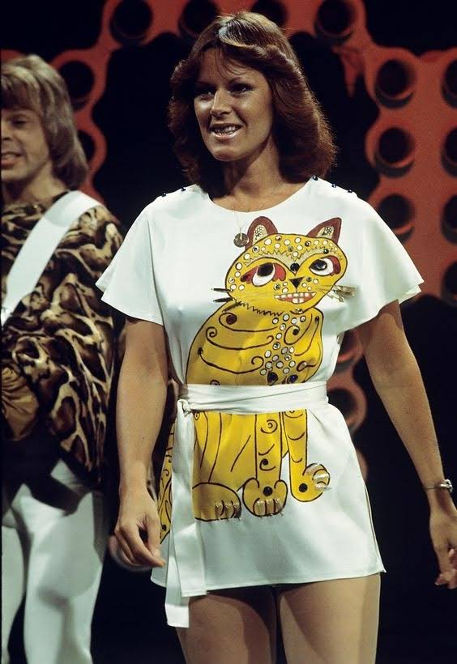

# ABBA, о чем ваши песни?

Скандинавия дала миру два великих нематериальных актива - 
шведскую музыкальную группу `ABBA` и финскую компьютерная игру `Angry Birds`.
Объединение этих названий в `angry-abba` хорошо отражает тематику сайта, который вы видите перед собой: песни `ABBA` не всегда про любовь и радость. Этот факт долгое время оставался вне моего внимания, но [случайный просмотр одного старого клипа](/articles/intro) стал толчком к тому, чтобы перевести с английского несколько их текстов и испытать сильное удивление. Оказалось, что некоторые песни `ABBA` представляют собой достаточно глубокие 
произведения с отсылками к философскому и историческому наследию. Есть в них 
и тревога за завтрашний день, и другие совсем неожиданные темы... 

В общем, получился небольшой цикл эссе: 

* [Слова не для всех (введение)](/articles/intro)
* [Без умолку безумная девица...](/articles/Bez-umolku-bezumnaya-devica)
* [Иудушка и девчуля](/articles/Iudushka-i-chiksa)
* [Fernando, или бойцы вспоминают минувшие дни](/articles/fernando-ili-bojcy-vspominayut-minuvshie-dni)
* [Happy New Дивный Новый Мир](/articles/Happy-New-Year)
* [Песня Тигрули](/articles/Pesnya-Tigruli)
* [Светят фонари в лицо недобро](/articles/Super-Trouper)
* [Маня и money](/articles/Money-money)
* [Маленькая, но гордая птичка](/articles/Eagle)
* [Алёнка-разведёнка](/articles/Alenka-razvedenka)
* [Hominem quaero, или мысли о женишках](/articles/gimme-gimme)
* [Заколдованные мальчики и девочки](/articles/The-Piper)

Кстати, слева на этой странице вы можете разглядеть смутное изображение некоего монстра. Это не плод моего больного воображения, а один из рисунков, размещенных на платьях Агнеты (пишется с одной «т») и Анни-Фрид, в которых они выступали во время гастролей «Сделано в Швеции» (1975 г.). Фанаты до сих пор восхищаются этими «милыми котиками», разработанными шведским дизайнером Уве Сандсртемом, но мало кто удосужился рассмотреть их поближе. Это к вопросу о том, является ли творчество `ABBA` «музыкой для домохозяек».

Еще один вариант фоновой картинки для этого сайта был создан с помощью искусственного интеллекта [Dream by WOMBO](https://dream.ai/create). Его можно посмотреть [здесь](/angry-abba.jpg), это небезынтересно как пример «автоматического творчества». 

В заключение отмечу, что большинство песен `ABBA`, все-таки, про любовь, надежду,
радость и романтические переживания, про все то, из-за чего популярная музыка и называется популярной. Но некоторый объем действительно интересных, глубоких текстов делает творчество группы тем, для чего действительно не жалко
приставки `super`. По крайней мере, анализируя их можно наделить знакомые и порой уже поднадоевшие хиты новой жизнью.

Замечания по внешнему виду сайта, ошибкам в текстах можно выражать через раздел [Issues](https://github.com/yababay/angry-abba/issues) странички проекта на `Github'e`. Связаться с автором можно также через час телеграм-канала [Random History](https://t.me/random_historical_pictures).

## Бонус-треки: не только ABBA

Парадоксальные тексты песен свойственны и произведениям других популярных исполнителей, мелодии которых звучат, если
опираться на первое впечатление, как развлекательные. Думаю, не стоит заводить для каждого такого случая
отдельный сайт, поэтому свои переводы таких песен буду публиковать здесь. 

* [Да разве это жизнь?](/articles/elo-life-meant-to-be)
* [Заезжий зануда](/articles/sting-englishman)
* [Искушение мисс Пигги](/articles/temptation)
* [А мог и ножичком пырнуть](/articles/mack-the-knife)
* [Кровожадная Ассоль](/articles/assol)
* [На свадьбе у французских гопников](/articles/mia-wallece)

